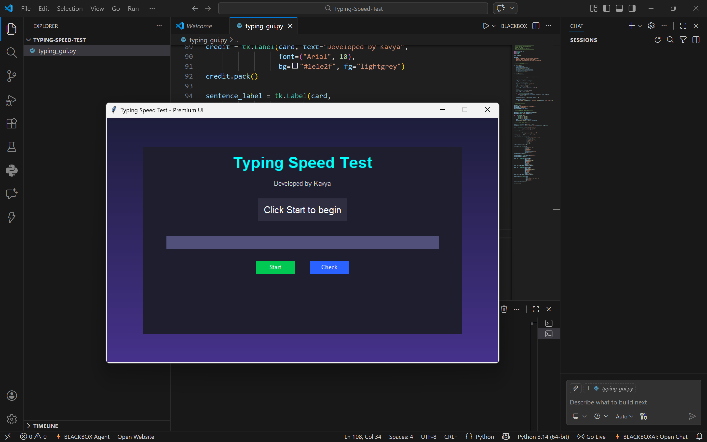
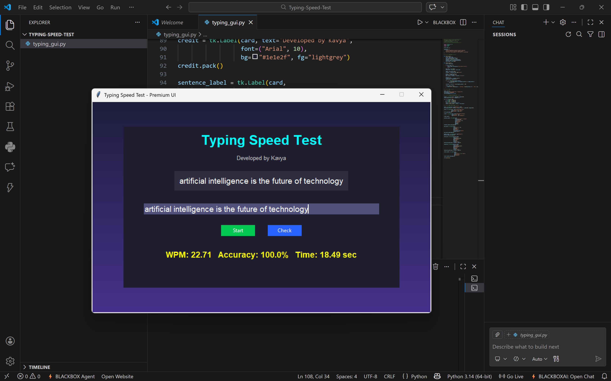

# 🖥️ Python Typing Speed Test

This is a simple Typing Speed Test application developed using Python and Tkinter.

It computes:
- ✅ Words Per Minute (WPM)
- ✅ Typing Accuracy
- ✅ Time Taken

# 🌐 Live Demo
 [🌐 Live Demo](https://kavya25007.github.io/python-typing-speed-test/)
---

## 🚀 Features

- Modern and clean GUI
- Real-time typing input
- WPM calculation
- Accuracy calculation
- Simple and user-friendly interface

---

## 🛠️ Technologies Used

- Python
- Tkinter (GUI Library)

---

## 📂 How to Run

1. Clone the repository:
   git clone https://github.com/Kavya25007/python-typing-speed-test.git

2. Open the project folder

3. Run the file:
   python typing_gui.py
   
---

## 🎯 Project Purpose

This project was developed to learn:
- Python GUI programming
- Logic development
- Basic project setup
- Git & GitHub handling

---

## 📸 Preview

### Main UI

### Result Screen

---

## 👩‍💻 Author

Kavya Kushwaha
First Year B.Tech CSE (AI & ML)
